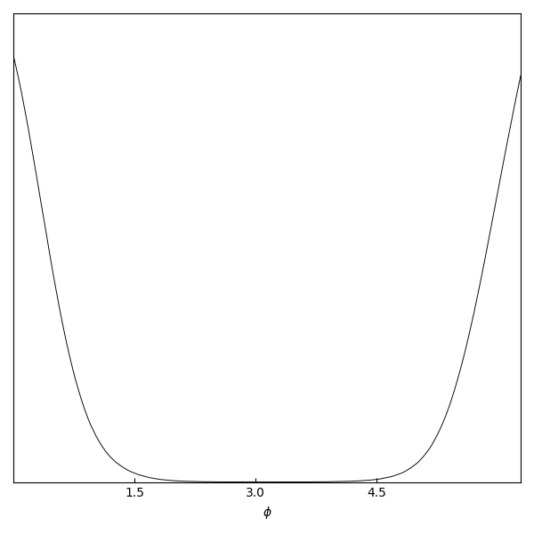

# geometric nested sampling

## Version

Version: 1.0

## Overview

Nested sampling algorithms are a family of algorithms designed to sample from posterior probability distributions associated with e.g. Bayesian inference. The overall idea in nested sampling is to convert an n-dimensional integral over the parameter space into a single dimensional integral over 'prior volume' and equivalently sample from this domain. The purpose of the geometric nested sampling algorithm presented here is to efficiently sample the distributions of parameters which exhibit certain geometrical properties e.g. circular, toroidal or spherical. Such parameters are rife in the astrophysics community, where many time- or angle-periodic parameters are present.

## The algorithm

Can run Markov Chain Monte Carlo (MCMC) Metropolis Hastings (MH) nested sampling algorithm in 'vanilla' (see https://projecteuclid.org/euclid.ba/1340370944 and https://arxiv.org/abs/0704.3704) and/or 'geometric' (https://arxiv.org/abs/1905.09110) sampling modes. See the appropriate papers for detailed explanations of how these algorithms operate.

In vanilla mode, the trial points are sampled in the physical (native) space of the input parameters.
In geometric mode (main point of the algorithm), parameter values represent points on a geometric object (e.g. circle, torus or sphere), and trial points are picked by sampling from spaces parameterised by Cartesian coordinates. If the sampled points do not lay on the original object (in general they will not), then they are projected back onto the object before being transformed back to the native space for evaluation of the MH acceptance ratio.

The sampling mode for each parameter is specified in `paramGeomList` passed through `setupDict` to `nestedRun()` ("vanilla", "wrapped" or "sphere"). "wrapped" parameters use a wrapped trial distribution. "sphere" parameters are transformed into their Euclidean representation and sampled in this space. Geometric sampling works best for parameters with 'periodic' sampling domains e.g. angles, as sampling in geometric space results in wrapping parameter values at end of domains. The sampler also works well for parameters which exhibit "spherical" properties. Note for sampling spherical sampling, two physical parameters are required for each geometric transformation. See `tests.py` for examples of how to specify what parameters are sampled in what way and the below section showing `paramGeomList` examples. 

Main output of geometric nested sampling run is file of sampled points and their weights. These are stored in `text_output/file_name.txt`, whose format follows that explained in https://getdist.readthedocs.io/en/latest/intro.html. Similarly, metadata files are also generated for each run e.g. `file_name.paramnames`, see https://getdist.readthedocs.io/en/latest/intro.html for more details on these files. The format of the text outputs is such that they can be plotted very easily using `getdist`, a kernel density esimate plotter.

## Toy models

To run with toy models (defined and explained in `toy_models.py`), go to `tests/` and run `tests.py`, which calls the function `runTests()`, which can be found in the `tests.py` file. Plots for comparison can be found in `image_output/toy_models_empirical_getdist/`. Text output can be found in `text_output/`. The default toy model used when `main.py` is ran as is when cloned from this repo, should be compared with files `image_output/toy_models_empirical_getdist/circle.png` (in particular, the MHWG curve on this plot). Files created from running main.py for this toy example are saved as th_Sc_mhwg* files in `text_output/` and `image_output/toy_models_empirical_getdist`. Further toy models can be run by adding them to `tests.py` and adjusting the necessary parameters (see the commented out example for how to configure the parameters). The following plot was produced from running the default circle toy model, and shows the kernel density esimate of samples obtained by the geometric nested sampler from the von Mises distribution.

Examples of `setupDict` objects used to specify parameters of a nested sampling run can be found in `setup_dicts.py`. 'verbose' corresponds to whether to output text during the sampling run, 'trapezoidalFlag' specifies whether to use the trapezoidal rectangular quadrature techniques for approximating the integral, 'ZLiveType' specifies how to determine the final contribution to the nested sample run, and shouldn't be significant if the algorithm is ran for a decent amount of time, 'terminationType' is a similar parameter, as is 'terminationFactor', 'sampler' is the type of sampler used i.e. Blind nested sampling, which involves randomly sampling values from the unit hypercube (B) Metropolis Hastings nested sampling (MH) geometric Metropolis Hastings nested sampling (MHWG), or use MultiNest if it is installed (MN). 'outputFile': is the location to store the text output from the runs, 'space' corresponds to whether the likelihood or log likelihood is used in calculations (and thus the corresponding function should be passed to the nested sampling algorithm through the appropriate arguments, see `nestedRun()`). 'paramGeomList': is a list of size of the dimensionality of the problem, and specifies how each parameter should be treated by the geometric nested sampler: 'vanilla', 'wrapped' or 'sphere' (must also be specified for the MH algorithm, which only accepts 'vanilla' values) Note for the toy models, none of these really need to be changed from their default in `tests.py` apart from `paramGeomList`, only the models chosen and the prefixes/suffixes used to index them need to be altered.

The toy models (see https://arxiv.org/abs/1905.09110) are designed to make use of the key features of geometric nested sampling, i.e. to take advantage of the way it treats parameters defined on curved manifolds. The three toy models which feature in `tests.py` by default are a circular distribution (von Mises distribution), a toroidal distribution (two-dimensional von Mises distribution), and 6 spheres with Kent distributions defined on them (for more on this see https://arxiv.org/abs/1905.09110 and https://www.jstor.org/stable/2984712?seq=1#page_scan_tab_contents). Many more are available in `toy_models.py`, all that needs to be configured is there `paramGeomList` values when added to `tests.py`, and the relevant suffixes/prefixes to index them.

## Example

~~~
import numpy as np
import gns.nested_run as nested_run
import gns.plotting as plotting
import gns.toy_models as toy_models
#see previous section for what different pairs in setupDict represent. 
setupDict = {'verbose':True, 'trapezoidalFlag': False, 'ZLiveType':'average X', 'terminationType':'evidence', 'terminationFactor': 0.1, 'sampler':None, 'outputFile':None, 'space':'log'}
shape = 'circle' #run circle toy model, simple von Mises distribution
sampler = 'MH WG' #jgeometric nested sampler
outputFile = '../text_output/example' #for text output
plotFile = '../image_output/example' #for image output
#get prior and likelihood functions from toy models for circle toy model
paramNames, priorParams, LhoodParams = toy_models.getToyHypersGeom(shape)
#can manually set paramNames e.g.
paramNames = [r"$\phi$"] #label plot
priorFunc, logPriorFunc, invPriorFunc, _, LLhoodFunc = toy_models.getToyFuncs(priorParams, LhoodParams)
nDims = 1 #number of parameters in inference
#array with first element giving lower bound of prior support, second giving upper bound, and third giving upper - lower. shape (3, nDims)
targetSupport = np.array([0., 2. * np.pi, 2. * np.pi]).reshape(3,1) 
#See next section for examples of paramGeomList. For simple one-dimensional circular example considered here, just need to consider one 'wrapped' parameter
setupDict['paramGeomList'] = ['wrapped']
setupDict['outputFile'] = outputFile
setupDict['sampler'] = sampler
nested_run.NestedRun(priorFunc, invPriorFunc, None, paramNames, targetSupport, setupDict, LLhoodFunc)
#plot data using getdist
#NOTE, calls to output.writeParamNames() and output.writeRanges() are made in nested_run to create .paramnames and .ranges files required by getdist
plotting.callGetDist([outputFile], plotFile + '.png', nDims, ['mhwg'])
~~~

## Running the algorithm with custom likelihood/prior functions

If custom priors/ likelihoods are to be used, one needs to call the `nestedRun()` function in the `gns.nested_run` module, and pass the required likelihood and prior functions. All of these functions must take as an argument a `numpy` array with shape `(nLive, nDims)` where `nLive` is the number of live points in the nested run, and is defined in the functions `NestedRunLinear` and `NestedRunLog` which are in the `nested_run.py` file. `nDims` is the dimensionality of the parameter space of the inference. Furthermore, these functions should return an array of size `(nLive)`, with the respective likelihood/prior values for each live point. Note the algorithm can be run in linear or log mode (by running `NestedRunLinear` or `NestedRunLog`, which is determined by the corresponding value in the `setupDict`), the latter of which requires a function which calculates the log likelihood. See `prob_funcs.py` for examples of such functions. Sampler will also work with probability distributions (and their inverse CDFs) defined in `scipy.stats`. 

Note that because the nested sampler samples in the unit hypercube, functions for the inverse of the CDF of the prior distributions are also required. This function also takes an array of size `(nLive, nDims)`, but returns an array of the same shape. Note also that the unit hypercube and physical parameter vectors take the shape `(nLive, nDims)`. 

Note that the geometric nested sampling algorithm has many tunable parameters, namely `nLive`, `maxTrials`, the max number of points to trial in each Markov chain, and the standard distributions of the trial distributions used in the Markov chains, `trialSigma` for `wrapped` parameters which is found in `samplers.py`, and `sigmaX`, `sigmaY`, `sigmaZ` for `sphere` parameters found in `geom_sampler.py`. The 'optimum' values of these parameters is entirely domain specific (though the sampler will generally be more accurate the higher `nLive` is), but refer to https://arxiv.org/abs/1905.09110 and https://www.repository.cam.ac.uk/handle/1810/293473 for more information on these parameters.

## `paramGeomList` examples

### Example 1

Consider a problem with `nLive = 5`, with the first two parameters exhibiting circular properties (i.e. a torus), the third being a vanilla paramater, and the last pair forming a pair of sperical parameters. Then `paramGeomList = ['wrapped', 'wrapped', 'vanilla', 'sphere', 'sphere']`

### Example 2

Different types of parameters don't have to be in sequential order. The example `paramGeomList = ['vanilla', 'wrapped', 'wrapped', 'wrapped', 'sphere', 'sphere', 'sphere', 'sphere', 'wrapped']` is perfectly valid and corresponds to the first parameter being sampled in vanilla model, the next three parameters being circular (3-torus), the following four being spherical, and thus defining the points on two spheres (with the first and third being the azimuthal angle of each sphere and the second and fourth being the polar angles), and the final parameter being circular.

In general the parameters can be in an arbitrary order, the only requirements are that the order of the list corresponds to the variable's position in the `(nLive, nDims)` arrays passed to the algorithm, and that spherical parameters come in (sequential) pairs.

## Additional features

Functions to calculate theoretical Bayesian evidence & H (K-L divergence) values are also provided, but not recommended in higher dimensional problems.

There is also a function to calculate the analytical posterior across a grid of the sampling space (or random samples), which produces files which can be input into getdist to be used for comparison with empirical results (assigns weights equal to Lhood or posterior for use in `getdist`). 
  
Plotting functions are also provided, in the form of simple `matplotlib` functions, as well as `getdist` (https://pypi.python.org/pypi/GetDist/) plotting functions.

Can also call MultiNest (https://arxiv.org/abs/0809.3437) by calling the pyMultiNest wrapper (https://github.com/JohannesBuchner/PyMultiNest) for comparison. 

These are automatically employed in `tests.py`, but can be turned on and off by setting the appropriate flags in the file. 

## Requirements

This package was developed and tested using `python 3.6` and thus I recommend using this version when running the algorithm. The two `wheel` files on PyPi are `py2` or `py3` files, the appropriate one will be selected by `pip` depending on whether it is called using `python 2.X` or `python 3.X`. Note however, I have not fully tested the `python 2.X` version and so I warn against using it.

## Installation

### Pip install

To install using pip, do 

`pip install GNS==1.0,` 

to install the gns algorithm and the requirements to run the algorithm. To also install the packages required for plotting, do 

`pip install GNS[plotting]==1.0.`

Finally, to install the gns package and include `MultiNest` algorithm runs (for comparison tests), do

`pip install GNS[multinest]==1.0.`

Note that the above do not install the tests found in the `tests/` directory

### git

No installation of the geometric nested sampler itself is strictly necessary, one can simply clone the gns repo:

`git clone https://github.com/SuperKam91/gns.git.`

Next, install all the modules included in the `requirements.txt` file (e.g. `pip install -r requirements.txt`) to be able to run the geometric nested sampling algorithm. To use the plotting functions featured in the package, one must also install all the files included in `requirements_plotting.txt`. I highly recommend installing the plot-dependent packages, to compare results the results of the toy models with those in `image_output`. Finally, to run MultiNest, install all packages in `requirements_mutlinest.txt`.

Alternatively, one can run `python setup.py install` or `pip install .` from the root of the repo to install the base requirements (i.e. those in `requirements.txt`) as well as the `GNS` package. As with the non-local `pip install` case, one can install the packages required for plotting and Multinest by doing or `pip install .[plotting]` (and similar for Multinest).

Note that by default, the tests in the `tests/` directory run the gns algorithm from the code in the repo in which `tests/` sits. To change this i.e. to use the installed package, in `tests.py`, set `run_repo = False`.
